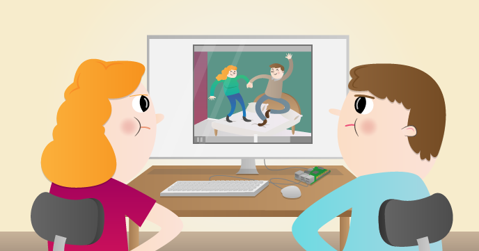

# A Raspberry Pi Parent Detector

How to use a Raspberry Pi to detect who's been in your room.

A Raspberry Pi is so small that it can easily be hidden; that makes it the perfect tool for this kind of project. The basic idea is to use motion detection to trigger video recording via the Raspberry Pi Camera Board. You can then leave the Pi hidden in your room and see who's been caught on camera when you get home from school.

## Lesson objectives

- Understand a Passive Infra Red motion sensor
- Understand how to use the `picamera` Python module
- Understand how to record videos
- Understand how to play back videos

## Lesson outcomes

- To have built and tested a Raspberry Pi parent detector
- Caught someone on camera
- Gained experience in Python programming
- Gained experience using the Raspberry Pi GPIO pins

## Requirements

As well as your Raspberry Pi and all its standard peripherals, you'll need:

### Hardware

- Raspberry Pi Camera Module
- PIR motion sensor module (try [eBay](http://search.ebay.co.uk/pir+motion+sensor+module))
- **Female-to-female** jumper wires, at least 3 (try [eBay](http://search.ebay.co.uk/female+to+female+jumper+wires+solderless))

### Extras

- Camera Board 360 Gooseneck Mount (from [modmypi.com](https://www.modmypi.com/flexible-camera-mount)) or equivalent

## Worksheet & included files

- [The worksheet](worksheet.md)
- (Optional) Final version of Python code [pirCamera.py](pirCamera.py)
    - Download to your Pi with `wget https://raw.githubusercontent.com/raspberrypilearning/parent-detector/master/code/pirCamera.py --no-check-certificate`
- (Optional) Final version of Python code [pirtest.py](pirtest.py)
    - Download to your Pi with `wget https://raw.githubusercontent.com/raspberrypilearning/parent-detector/master/code/pirtest.py --no-check-certificate`

## Licence

Unless otherwise specified, everything in this repository is covered by the following licence:

***Parent Detector*** by the [Raspberry Pi Foundation](http://raspberrypi.org) is licenced under a [Creative Commons Attribution 4.0 International License](http://creativecommons.org/licenses/by-sa/4.0/).

Based on a work at https://github.com/raspberrypilearning/parent-detector
