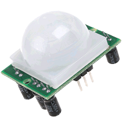
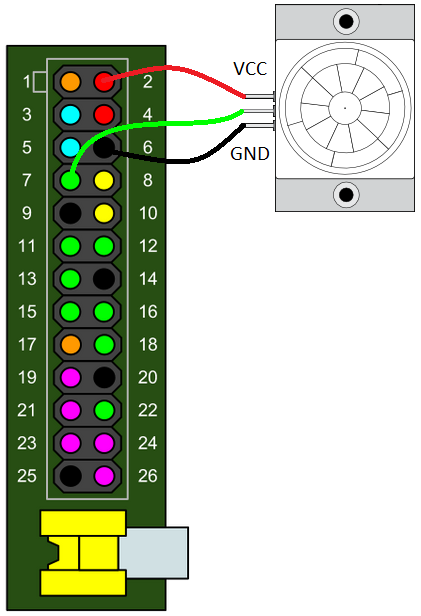
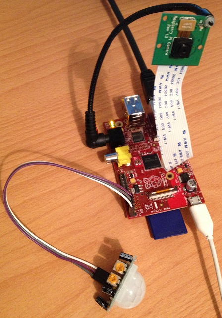

#A Raspberry Pi Parent Detector


How to use a Raspberry Pi to detect who's been in your room


A Raspberry Pi is so small that it can easily be hidden or concealed and that makes it the perfect tool for this kind of project.  The basic idea here is that we’re going to use motion detection to trigger video recording via the Raspberry Pi Camera Board.  You can then leave the Pi hidden in your room and see who's been caught on camera when you get home from School.

##Lesson objective
* Understand a Passive Infra Red motion sesnor
* Understand how to use the `picamera` Python module
* Understand how to record videos
* Understand how to play back videos

##Lesson outcome
*	To have built and tested a Raspberry Pi parent detector
*	Caught someone on camera
*	Gained experience in Python programming
*	Gained experience using the Raspberry Pi GPIO pins

##Time
*	1-2 hours

##Requirements
*	Raspberry Pi
*	Micro USB power adapter
*	An SD Card with Raspbian already set up through NOOBS
*	USB Keyboard
*	USB Mouse
*	HDMI cable
*	A Monitor or TV
*	Raspberry Pi Camera Board
*	PIR Motion Sensor Module (try [eBay](http://search.ebay.co.uk/pir+motion+sensor+module "eBay search"))
*	**Female** to **Female** jumper wires, at least 3 (try [eBay](http://search.ebay.co.uk/female+to+female+jumper+wires+solderless "eBay search"))

##Recommended
*	Camera Board 360 Gooseneck Mount (from [modmypi.com](https://www.modmypi.com/flexible-camera-mount "ModMyPi | RPi Camera Board 360 Gooseneck Mount"))

##Introduction - so what is a PIR module?

PIR stands for Passive Infra Red.  You’ve all seen these things before, they are tremendously common these days.  Most often found in the corners of rooms for burglar alarm systems.  All objects that are above absolute zero emit radiation in the form of infra red.  Infra red wavelengths are not visible to the human eye but they can be detected by the electronics inside one of these modules.

The sensor is regarded as passive because it doesn’t send out any signal in order to detect movement.  It adjusts itself to the infra red signature of the room it’s in and then watches for any changes.  Any object moving through the room will disturb the infra red signature and will cause a change to be noticed by the PIR module.



We don’t need to worry about its inner workings.  What we’re interested in are those three pins on it.  We can connect those to the Raspberry Pi GPIO pins.  One is for +5 volts, one is for ground and the other is the sensor pin (the middle pin on our one).  That pin will receive power whenever motion is detected by the PIR module.  We can then see that happening on the Raspberry Pi and take action accordingly.

## Step 0: Setting Up your Pi
First check that you have all the parts you need to get your Raspberry Pi set up and working.

- Raspberry Pi
- Micro USB power adapter
- An SD Card with Raspbian already set up through NOOBS
- USB Keyboard
- USB Mouse
- HDMI cable
- A Monitor or TV

###Activity Checklist

1.	Place the SD card into the slot of your Raspberry Pi. It will only fit one way so be careful not to break the card. 
2.	Next connect the HDMI cable from the monitor (or TV) to the HDMI port on the Pi and turn on your monitor. 
3.	Plug the USB keyboard and mouse into the USB slots on the Pi.
4.	Plug in the micro USB power supply and you should see some text appear on your screen.
5.  When prompted to login type:

    ```
    Login: pi
    Password: raspberry
    ```

##Step 1: Connect the PIR motion sensor

This should ideally be connected with the Raspberry Pi turned off for safety.  Use the following command to shut down the Pi.

`sudo halt`

Wait for the ACT (activity) LED to stop blinking before turning off the power.  Follow the instructions below to connect the PIR module to the Raspberry Pi.



Refer to the diagram above for pin numbers.  If you look closely at the pins on your PIR module you’ll see some white text on the PCB near the base of each one.  `VCC` is for +5 volts input.  Take one of the **female** to **female** jumpers and connect the VCC pin to pin 2 (red) on the Pi, this will make the Pi give 5 volts of power to the PIR module.  Use another jumper to connect `GND` on the module to pin 6 (black) on the Pi, this completes the circuit and allows current to flow back out of the module into ground.  Now do the same for the sensor pin `OUT`, you can use any of the green pins on the Pi for this but I am going to use pin number 7 (since it’s the first general purpose one).

**Note**: If you have a different PIR module to our one then your pin layout might be different, this is why I refer you to the labels `VCC` `GND` and `OUT`.

Turn the Pi back on and log in.

##Step 2: Test the PIR motion sensor

We're going to use the Python programming language to write some code that will detect movement and print out some text (we can extend the program to involve the Camera Board later on).  When movement is detected the PIR motion sensor applies power to its OUT pin which we have connected to GPIO pin 7 on the Pi.  So in our code we just need to continually check pin 7 to see if it has power or not.

If a pin has power we call this **HIGH** and if not we call it **LOW**.

The program is pretty simple.  We're first setting up the Raspberry Pi GPIO pins to allow us to use pin number 7 as an input (so it can detect when the PIR module sends power).  We need to continually check the pin for any changes so a `while True` loop is used for this.  This is an infinite loop so the program will just run forever unless we stop it manually with `Ctrl - C`.

We then use two Boolean (True or False) variables for the previous state and the current state of the pin, the previous state being what the current state was the previous time around the loop.  Inside the loop we compare the previous state to the current state to detect when they're different.  We don't want to keep displaying a message if there has been no change.

Firstly create a blank Python file with the following command.

`nano pirtest.py`

Enter or copy and paste the code below.

```python
#!/usr/bin/python
import RPi.GPIO as GPIO
import time

sensorPin = 7

GPIO.setmode(GPIO.BOARD)
GPIO.setup(sensorPin, GPIO.IN, pull_up_down=GPIO.PUD_DOWN)

prevState = False
currState = False

while True:
    time.sleep(.1)
    prevState = currState
    currState = GPIO.input(sensorPin)
    if currState != prevState:
        print "GPIO pin {0} is {1}".format(sensorPin, "HIGH" if currState else "LOW")
```

Press `Ctrl - O` to save and `Ctrl - X` to quit.

Next make the Python file executable and then you can run it.

```
chmod +x pirtest.py
sudo ./pirtest.py
```

If you get an error saying `RuntimeError: No access to /dev/mem` it means you forgot to use `sudo`.  You must run programs that access the GPIO as root and `sudo` does this for you.  Think of it as super-user-do.  

If you start moving or waving it will go HIGH.  Keep on waving and it will stay HIGH and only go back to LOW if you keep still again.  If this is what you have then everything is working correctly.  If not then something is wrong and you need to go back and troubleshoot.

```
GPIO pin 7 is HIGH
GPIO pin 7 is LOW
GPIO pin 7 is HIGH
```

Press `Ctrl – C` when you want to exit.


On the PIR module you should have two orange coloured components that look like they take a phillips screwdriver (see above).  These things are called *potentiometers* and they allow you to adjust the sensitivity of the sensor and the detection time.  I would suggest to have sensitivity set to max and time to min, the choice is yours though.

##Step 3: Setting up the Camera Board

Follow the official instructions [here](http://www.raspberrypi.org/camera "Camera | Raspberry Pi") to setup and test the Raspberry Pi Camera Board.  Stop once you have successfully used a few of the example commands.

Next, if you have it, set up the 360 Gooseneck Mount.  This will allow you to aim the camera at the right part of the room.  One end of it inserts into the headphone jack on the Pi (it just uses this to hold itself and does nothing to the audio jack), the other end is a screw with a couple of plastic washers that secure the camera board to the gooseneck.

You should then have something a bit like this below.  Please note the [red](http://mall.egoman.com.cn/index.php?option=com_content&view=article&id=75&Itemid=218 "Raspberry Pi树莓") Raspberry Pi is not available outside of China, Hong Kong and Taiwan.



If you have not done so already test the camera is working using the following command.

`raspivid -t 0`

Press `Ctrl - C` to exit.

##Step 4: Install the picamera Python module

To control the Camera Board using the Python programming language we need to install a module called [picamera](http://picamera.readthedocs.org "Documentation for picamera").  Use the following commands to do this at the Linux prompt.

```
sudp apt-get update
sudo apt-get install python-picamera
```

This will take a minute or two to complete.

##Step 5: Program the camera to preview on movement

Okay now we're ready to extend our previous program to give it the ability to control the Camera Board.  To start with let's just make our program display what the camera can see when movement is detected and we can set up recording to file later.

Make a copy of the previous program and we'll use that.

`cp pirtest.py pirCamera.py`

Now use the following command to edit the file.

`nano pirCamera.py`

We first need to add the `import picamera` statement at the top, this allows your program to access the premade code which can control the Camera Board.  We then declare the camera object `cam`, this provides all the camera control functions that we need to use.  Then inside the `while` loop where we print the **HIGH** or **LOW** message, we can test to see if `currState` is HIGH / True (meaning movement is detected) and start or stop the camera preview accordingly.

Either modify manually or copy and paste the code below.

```python
#!/usr/bin/python
import RPi.GPIO as GPIO
import time
import picamera #new

sensorPin = 7

GPIO.setmode(GPIO.BOARD)
GPIO.setup(sensorPin, GPIO.IN, pull_up_down=GPIO.PUD_DOWN)

prevState = False
currState = False

cam = picamera.PiCamera() #new

while True:
    time.sleep(.1)
    prevState = currState
    currState = GPIO.input(sensorPin)
    if currState != prevState:
        print "GPIO pin {0} is {1}".format(sensorPin, "HIGH" if currState else "LOW")
        if currState: #new
            cam.start_preview()
        else:
            cam.stop_preview()
```

Press `Ctrl - O` to save and `Ctrl - X` to quit.  To run the program use the following command.

`sudo ./pirCamera.py`

Press `Ctrl – C` when you want to exit.

##Step 6: Recording to file and playing back

We can just add a tiny bit more code to allow us to record to file for playback at a later stage.  Ideally if there are many intruders in your room then you want to capture them all and not just the most recent one.  So to do that we need a way to automatically generate a new file name each time movement is detected.  The easiest and safest way to do this is to make a file name out of the date and time.

For example if the time now was the 11th of Feb 2014 at 10:24 AM and 18 seconds the file name would be something like this: `2014-02-11_10.24.18.h264`.  This uses the format of `YEAR-MONTH-DAY_HOUR.MINUTE.SECOND.h264`, the h264 part is the format the video will be recorded in.  It's the same format used by YouTube.

To do this we need to import the `datetime` Python module and write a function to generate the filename.  See `getFileName` below, this uses the *string from time* function to insert the values from the current time into the specified string format.  It's then just a matter of using the commands to start and stop the recording using the generated file name.  These should happen at the same time as the preview commands respectively.

`nano pirCamera.py`

Either modify manually or copy and paste the code below.

```python
#!/usr/bin/python
import RPi.GPIO as GPIO
import time
import picamera
import datetime #new

def getFileName(): #new
    return datetime.datetime.now().strftime("%Y-%m-%d_%H.%M.%S.h264")

sensorPin = 7

GPIO.setmode(GPIO.BOARD)
GPIO.setup(sensorPin, GPIO.IN, pull_up_down=GPIO.PUD_DOWN)

prevState = False
currState = False

cam = picamera.PiCamera()

while True:
    time.sleep(.1)
    prevState = currState
    currState = GPIO.input(sensorPin)
    if currState != prevState:
        print "GPIO pin {0} is {1}".format(sensorPin, "HIGH" if currState else "LOW")
        if currState:
            fileName = getFileName() #new
            cam.start_preview()
            cam.start_recording(fileName) #new
        else:
            cam.stop_preview()
            cam.stop_recording() #new
```

Press `Ctrl - O` to save and `Ctrl - X` to quit.  To run the program use the following command.

`sudo ./pirCamera.py`

Press `Ctrl – C` when you want to exit.

###Playback

If you now use the `ls` command you should see that a few files have been generated.  You can use the following command to play back a file.  Replace `<file>` with the filename you wish to play.

`omxplayer <file> -o hdmi`

For example: `omxplayer 2014-02-11_10.24.18.h264 -o hdmi`

**Tip**: Use the `TAB` key for auto complete when typing in Linux commands or file names.


##Step 7: Stealth mode

You have probably noticed the red LED on the camera board come on when you start your Python program.  This will be quite noticeable to any would be intruder and it's a good idea to disable it.  This can be done by editing the Raspberry Pi configuration file.  Enter the command below.

`sudo nano /boot/config.txt`

Add the following line to the end of the file.

`disable_camera_led=1`

Press `Ctrl - O` to save and `Ctrl - X` to quit.  The changes will only take effect after a reboot.

`sudo reboot`

If you want to leave the monitor connected and turned on while the program is running it’s a good idea to edit the Python code to disable the camera *preview* lines.  Use the `#` sign at the start of a line to disable it.

Another trick you can do is to start your Python program under a different login.  To do this press `ALT - F2` before you log in.  This will show you a new login prompt, login there and start the Python program.  Now if you press `ALT - F1` to go back to the usual login prompt it will appear as though the Raspberry Pi is innocently waiting for someone to log in.  

Now all you have to do is set the trap and wait, good luck!
