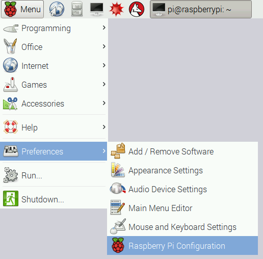
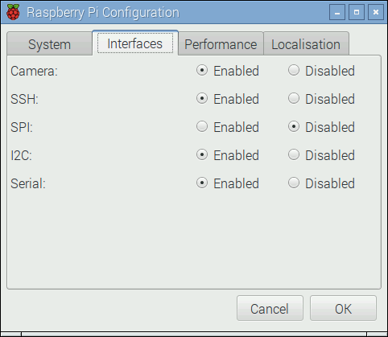

## Setting up a Picamera

The camera module is a great accessory for the Raspberry Pi, allowing users to take still pictures and record video in full HD.

## Connect the camera module

First of all, with the Pi switched off, you'll need to connect the camera module to the Raspberry Pi's camera port, then start up the Pi and ensure the software is enabled.

1. Locate the camera port and connect the camera:

    

1. Start up the Pi.

1. Open the **Raspberry Pi Configuration Tool** from the main menu:

    

1. Ensure the camera software is enabled:

    

    If it's not enabled, enable it and reboot your Pi to begin.

## Testing the camera.

It's always a good idea to test the camera is working after you've set it up.
Open up a Terminal by holding down `ctrl`+`alt`+`t`.

Now you can type a single command to test whether the camera is working or not. First though, you can move into your `Desktop` directory

``` bash
cd ~/Desktop
```

Then take a picture:

``` bash
raspistill -o 'my_pic.jpg'
```

After a few seconds a photo should be taken and you you'll find it on your Desktop. Double click it to check the image.
